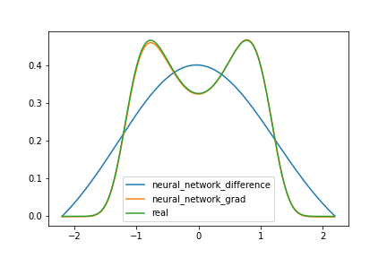

# PDEs_by_DL
This repository hosts a PyTorch implementation for the paper 
'Solving Fokker-Planck equation using deep learning' by Yong Xu, Hao Zhang et al.

It will be different from the original paper due some implement detail(I use two approaches to
implement how to get deriviate of neural network).

## Run the code
`python train.py --phase='grad'`

Default phase is 'grad', where other phases like 'difference' can be chosen.

use the following code:

`python train.py --phase='difference'`

## Result

After 30000 iterations training, loss will drop to about $10^{-7}$.

